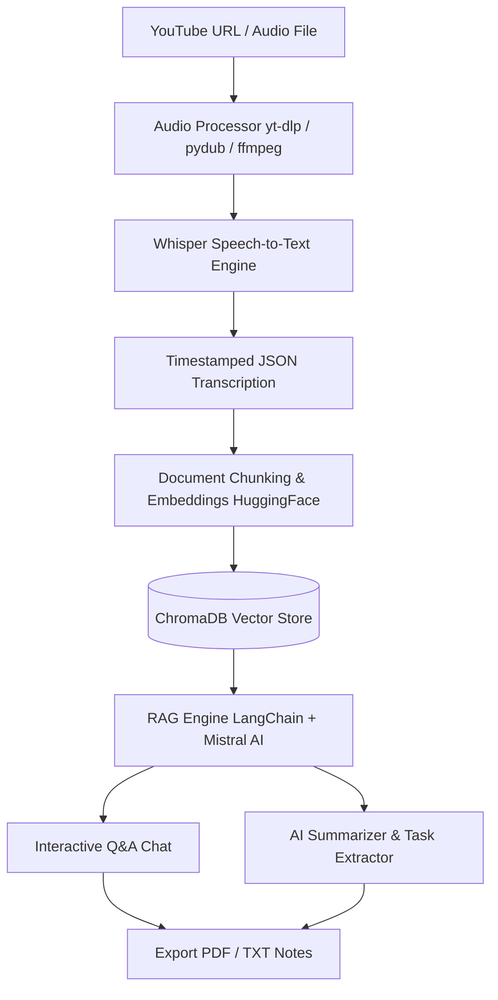

# 🎓 Lectura AI — YouTube & Lecture Study Assistant

[](https://python.org)
[](https://fastapi.tiangolo.com)
[](https://streamlit.io)
[](https://langchain.com)
[](https://github.com/openai/whisper)
[](https://trychroma.com)

**Lectura AI** is an intelligent, end-to-end study assistant designed to transform long educational videos, YouTube lectures, and local audio recordings into structured, interactive knowledge bases. 

It automatically transcribes audio using **OpenAI Whisper**, indexes lecture content into a **ChromaDB vector store**, generates AI summaries & action items with **Mistral AI**, allows real-time interactive **RAG Q&A**, and exports complete lecture notes to **PDF** or **TXT**.

---

## 🌟 Key Features

- 🎙️ **Multi-Source Audio Processing**: Ingest YouTube URLs or local audio files (`.mp3`, `.wav`, `.m4a`). Automatically downloads, converts, and splits audio using `yt-dlp` and `ffmpeg`.
- ⚡ **Local Speech-to-Text Transcription**: Powered by **OpenAI Whisper** for high-accuracy timestamped transcriptions.
- 🧠 **Retrieval-Augmented Generation (RAG)**: Index lecture transcriptions into ChromaDB using HuggingFace embeddings (`sentence-transformers`) for fast, context-aware vector retrieval.
- 🤖 **Mistral AI Summarization & Task Extraction**: Automatically generates concise executive summaries, key takeaways, and extracted study questions/tasks.
- 💬 **Interactive Timestamped Q&A**: Ask any question about the lecture and receive accurate answers with direct time references.
- 📄 **PDF & TXT Export**: Download polished lecture notes, summaries, and Q&A history formatted into clean PDF or TXT documents.
- 🎨 **Dual Interface**:
  - **Streamlit Web UI** ([`app.py`](file:///c:/rag-based-ai/app.py)): Clean, interactive dashboard for desktop & Cloud deployment.
  - **FastAPI Server** ([`server.py`](file:///c:/rag-based-ai/server.py)): High-performance REST API serving custom HTML/JS frontend ([`static/index.html`](file:///c:/rag-based-ai/static/index.html)).

---

## 🏗️ System Architecture



---

## 📁 Repository Structure

```
rag-based-ai/
├── app.py                   # Streamlit web application dashboard
├── server.py                # FastAPI server backend & REST endpoints
├── requirements.txt         # Python package dependencies
├── packages.txt             # System package dependencies (ffmpeg for cloud hosting)
├── Dockerfile               # Production Docker container configuration
├── docker-compose.yml       # Docker Compose service definition
├── .env                     # Local environment variables
│
├── core/                    # Core RAG & AI pipeline logic
│   ├── transcriber.py       # OpenAI Whisper transcription runner
│   ├── document_creator.py  # LangChain document loader & chunk splitter
│   ├── vector_store.py      # ChromaDB vector index builder
│   ├── rag_engine.py        # LangChain LCEL RAG chain for Q&A
│   ├── summarizer.py        # Mistral AI summary generation
│   └── task_extractor.py    # Action item & study task extraction
│
├── utils/                   # Processing & export utilities
│   ├── audio_processor.py   # YouTube downloading & audio conversion
│   └── exporter.py          # PDF (fpdf2) and TXT export generators
│
├── static/                  # Static assets & web interface (FastAPI)
│   └── index.html           # Modern HTML5/CSS3/JS Web UI
│
├── data/                    # Generated runtime vector databases & JSON transcriptions
└── downloads/               # Output storage for downloaded media & generated PDFs
```

---

## 🚀 Quick Start & Local Setup

### Prerequisites
- **Python 3.10+** installed.
- **FFmpeg** installed on your system path.
  - *Windows*: `winget install ffmpeg` or `choco install ffmpeg`
  - *macOS*: `brew install ffmpeg`
  - *Linux*: `sudo apt install ffmpeg`

### 1. Clone the Repository
```bash
git clone https://github.com/YOUR_USERNAME/lectura-ai.git
cd lectura-ai
```

### 2. Create Virtual Environment & Install Dependencies
```bash
# Create virtual environment
python -m venv .venv

# Activate virtual environment
# On Windows:
.venv\Scripts\activate
# On macOS/Linux:
source .venv/bin/activate

# Install dependencies
pip install -r requirements.txt
```

### 3. Configure Environment Variables
Create a `.env` file in the root directory:
```env
MISTRAL_API_KEY=your_mistral_api_key_here
```
> *(Get a free Mistral API key at [console.mistral.ai](https://console.mistral.ai))*

---

## 💻 Running the Application

### Option A: Streamlit UI (Recommended for local desktop use)
```bash
streamlit run app.py
```
Open your browser at **`http://localhost:8501`**.

### Option B: FastAPI Backend + Web UI
```bash
uvicorn server.py:app --reload --port 8000
```
Open your browser at **`http://localhost:8000`** to view the frontend, or visit **`http://localhost:8000/docs`** for interactive Swagger API documentation.

### Option C: Running via Docker Compose
```bash
docker compose up -d --build
```
Your service will be available at **`http://localhost:8000`**.

---

## 🌐 Free Cloud Hosting Guide

### Deploying to Streamlit Community Cloud (100% Free)
1. Push this repository to **GitHub**.
2. Go to **[share.streamlit.io](https://share.streamlit.io)** and log in with GitHub.
3. Click **New app**, select your repository, and set `app.py` as the main file path.
4. Under **Advanced Settings ➔ Secrets**, add:
   ```toml
   MISTRAL_API_KEY = "your_mistral_api_key_here"
   ```
5. Click **Deploy!** *(System dependencies in `packages.txt` will automatically install `ffmpeg`)*.

---

## 🔌 API Endpoints Summary (FastAPI)

| Method | Endpoint | Description |
| :--- | :--- | :--- |
| `GET` | `/api/status` | Returns system status, vector DB state, and loaded media info |
| `POST` | `/api/ingest` | Ingests YouTube URL or uploaded audio file for processing |
| `POST` | `/api/chat` | Asks a question against the indexed vector store using RAG |
| `GET` | `/api/summary` | Retrieves or generates AI lecture summary |
| `GET` | `/api/tasks` | Extracts key study tasks and questions |
| `GET` | `/api/export/pdf` | Downloads formatted PDF notes |
| `GET` | `/api/export/txt` | Downloads raw text export |

---

## 📜 License

Distributed under the **MIT License**. See `LICENSE` for more information.

---

<p align="center">
  Made with ❤️ for students, researchers, and lifelong learners.
</p>
